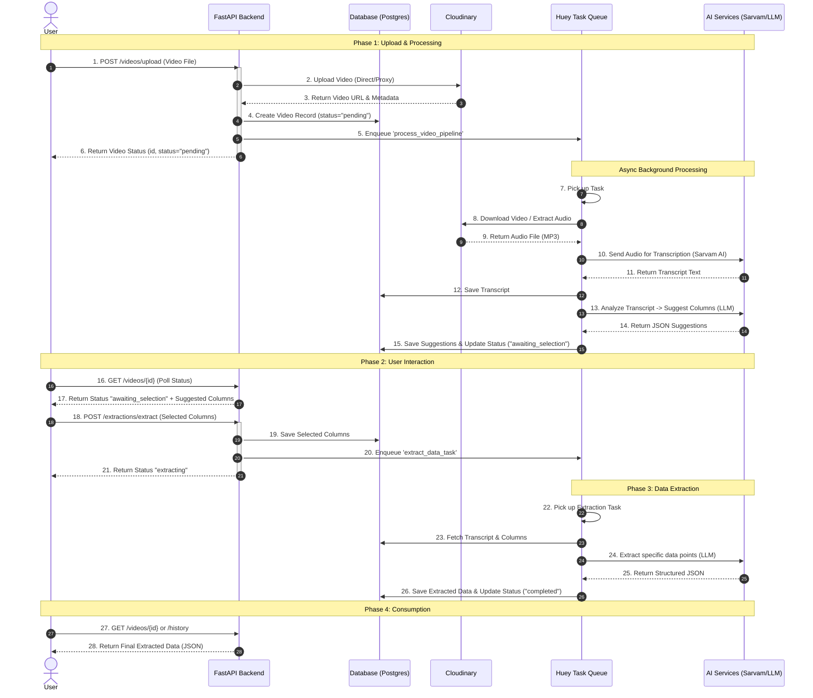

# Backend User Flow and Architecture

This document describes the end-to-end workflow of the AI Reel Pipeline, detailing how a user interacts with the system and how the backend processes video data to extract structured information.

## Why is this useful?

The AI Reel Pipeline automates the tedious process of extracting structured data from unstructured video content (e.g., real estate walkthroughs).

1. **Efficiency**: Replaces hours of manual video watching and note-taking with automated processing. Ideally suited for high-volume content ingestion.
2. **Accuracy**: Computerized transcription and extraction reduce human error and fatigue, ensuring consistent data capture across thousands of videos.
3. **Structured Data**: Transforms raw media (MP4/MP3) into queryable, structured JSON data and database records, enabling powerful search, analytics, and integration with other systems (CRM, listings).
4. **Scalability**: The asynchronous architecture (Huey + Cloudinary) allows for parallel processing of multiple videos without blocking the user interface.
5. **Interactivity**: The "Human-in-the-Loop" design (Column Suggestion -> User Selection -> Extraction) ensures the AI focuses exactly on what the user needs, adapting to different video types dynamically.

---

## End-to-End Workflow Diagram

The following interactive chart illustrates the system architecture and data flow.
*(View this in VS Code or GitHub to interact with the diagram)*

## detailed System Components

### 1. Frontend / User

- Initiates the upload.
- Periodically polls for status updates.
- Reviews AI suggestions and selects fields of interest.
- Consumes the final JSON output.

### 2. API Layer (FastAPI)

- Handles authentication and validation.
- Orchestrates the flow between User, Database, and Queue.
- Proxies huge file uploads to Cloudinary to keep the server lightweight.

### 3. Background Workers (Huey)

- **Critical Component**: Decouples heavy processing (transcription, LLM calls) from the user-facing API.
- Ensures the API remains responsive (sub-100ms response times) even when processing hour-long videos.
- Handles retries and failures gracefully.

### 4. AI Services

- **Sarvam AI**: Specialized for highly accurate transcription (Speech-to-Text), handling diverse accents and languages.
- **LLM (Claude/GPT)**: The "brain" that understands the context of the transcript to suggest relevant data fields and extract precise values based on user intent.
